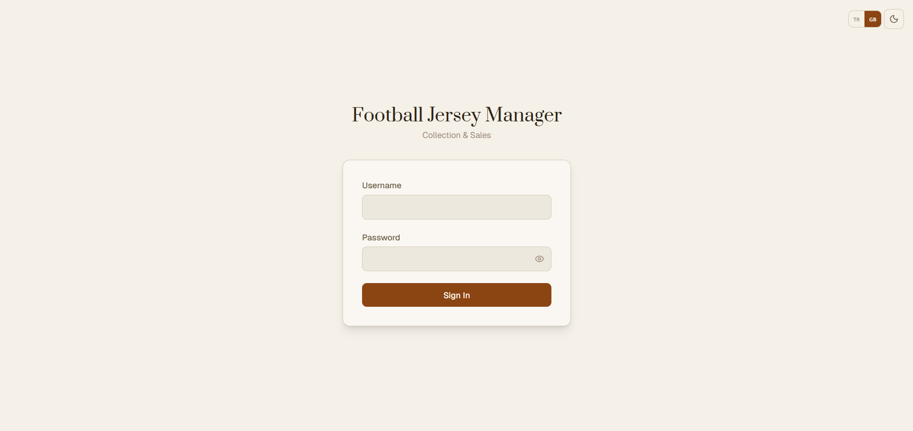

# Football Shirt Management System

A full-stack web application for managing a football shirt collection. Track your inventory, record sales and purchases, maintain a wishlist, manage seller contacts, and analyse your business performance — all from a single admin panel. A public-facing storefront lets potential buyers browse available listings without an account.

Built with the MERN stack, styled with a handcrafted Vintage Paper theme, and designed mobile-first for collectors who buy and sell football shirts.

**Live demo:** [ildivincodino.vercel.app/products](https://ildivincodino.vercel.app/products)

---

## Screenshots

### Public Storefront


### Login


### For Sale — Inventory Management


### Jersey Detail Dialog


### Add / Edit Jersey Form


### Sold — Sales History


### Wishlist


### Purchased


### Sellers


### Reminders


### Statistics


### Reports


### Planner


### Settings


---

## Features

### Inventory Management
- Add jerseys with multiple images (drag-and-drop upload, auto-converted to WebP via Cloudinary)
- Rich metadata: team, league, season, type (Home/Away/3rd/etc.), quality (Supporter/Replica/Authentic/Player Issue/Match Worn), brand, technology, size variants with individual stock counts, condition, measurements (armpit/length in cm), sponsor, printing details (player name/number), patches
- Multi-platform listing links (Dolap, Sahibinden, Letgo, eBay, Vinted)
- Feature ("pin") jerseys to appear at the top of the storefront
- Duplicate a jersey entry with one click
- Mark as sold — automatically reduces stock; moves to Sold when stock hits zero
- Table view and grid card view (3:4 aspect ratio)
- Advanced filtering: team, league, country, season, type, quality, brand, size, condition, price range

### Sales Tracking
- Record buyer name, username, phone, platform, payment method, sale price, and date
- View full sales history with profit calculation per item

### Purchase Tracking
- Log every purchase (including personal/collection pieces)
- Link purchases to a seller record
- Optionally push a purchased item directly to the For Sale inventory

### Wishlist
- Track shirts you want to buy with target price and listing URL
- Priority levels (low / medium / high)
- One-click "Buy" flow: creates a Purchase record and marks the wishlist item as purchased

### Sellers
- Contact book for sellers across platforms (Dolap, Instagram, eBay, etc.)
- WhatsApp deep-link integration (E.164 phone format)
- Purchase count per seller

### Reminders
- Track buyer requests for shirts you don't currently have
- Status workflow: Open → Notified → Closed
- Direct contact via WhatsApp

### Statistics
- Dashboard cards: total sales, revenue, net profit, active listings, stock value
- Charts: monthly sales volume, monthly revenue/profit, team-based sales distribution, size distribution, platform performance, top-10 selling teams, buyer history

### Reports
- Organised by year and month
- Per-period summary: items sold, items purchased, buy/sell spread, profit margin, revenue, net profit, platform breakdown

### Planner
- Calendar view for planning social media posts and listing activity
- Item types: Share, List, Photo, Task
- Per-day dot indicators colour-coded by type
- Toggle items between pending and done

### Public Storefront (`/products` — no login required)
- Clean card grid accessible to anyone
- Filters: team, type, quality, size, condition, brand, league, season, colour, price range
- Full-text search and sorting (price, date, team)
- Detailed jersey dialog with drag-scroll image gallery
- Contact links (WhatsApp, Dolap, eBay, etc.) configurable from Settings

### Settings
- Storefront title and contact links
- Language (Turkish / English), currency (TRY / EUR / USD / GBP), and theme — all persisted per user

### Internationalisation
- Full Turkish and English support across all pages and forms
- Language toggle available in Settings and on the storefront

---

## Tech Stack

| Layer | Technology |
|---|---|
| Frontend | React 19, Vite 7, React Router 7 |
| Styling | Tailwind CSS 4, Radix UI (Shadcn-compatible) |
| State | Zustand, React Hook Form, Zod |
| Charts | Recharts |
| Drag & Drop | @dnd-kit |
| Animations | Framer Motion |
| Notifications | Sonner, Radix AlertDialog |
| i18n | i18next, react-i18next |
| Backend | Node.js, Express 5 (ESM) |
| Database | MongoDB, Mongoose 9 |
| Auth | JWT — single admin user |
| Media | Cloudinary (WebP, quality:auto:good, max 1200px) |
| Frontend Deploy | Vercel |
| Backend Deploy | Railway |

---

## Project Structure

```
footballshirt-management-system/
├── client/                       # React + Vite
│   ├── public/data/
│   │   ├── teams.json            # 168 teams (static)
│   │   ├── competitions.json     # Country/league hierarchy
│   │   ├── brands.json
│   │   └── technologies.json
│   └── src/
│       ├── components/
│       │   ├── ui/               # Radix UI base components
│       │   ├── common/           # Shared custom components
│       │   └── layout/           # Sidebar, Header, MobileNav
│       ├── pages/                # One folder per route
│       ├── store/                # Zustand stores
│       ├── hooks/                # Custom hooks
│       ├── services/api.js       # Axios instance + all API services
│       └── lib/                  # utils, constants
└── server/                       # Express (ESM)
    └── src/
        ├── controllers/
        ├── models/
        ├── routes/
        ├── middleware/            # auth, upload, error
        └── services/             # cloudinary.service.js
```

---

## Getting Started

### Prerequisites

- Node.js 20+
- MongoDB (local or Atlas)
- Cloudinary account (free tier is sufficient)

### 1. Clone the repository

```bash
git clone https://github.com/semihkececioglu/footballshirt-management-system.git
cd footballshirt-management-system
```

### 2. Server setup

```bash
cd server
npm install
```

Create `server/.env`:

```env
PORT=5000
MONGODB_URI=mongodb://localhost:27017/footballshirts
JWT_SECRET=your_jwt_secret_here
JWT_EXPIRES_IN=7d
ADMIN_USERNAME=admin
ADMIN_PASSWORD_HASH=your_bcrypt_hash
CLOUDINARY_CLOUD_NAME=your_cloud_name
CLOUDINARY_API_KEY=your_api_key
CLOUDINARY_API_SECRET=your_api_secret
CLIENT_URL=http://localhost:5173
```

Generate a password hash:

```bash
node src/utils/hash.js yourpassword
```

### 3. Client setup

```bash
cd client
npm install
```

Create `client/.env`:

```env
VITE_API_URL=http://localhost:5000/api
```

### 4. Run in development

```bash
# Terminal 1 — backend
cd server && npm run dev

# Terminal 2 — frontend
cd client && npm run dev
```

App: `http://localhost:5173`
Admin panel: `http://localhost:5173/login`
Public storefront: `http://localhost:5173/products`

---

## Deployment

### Backend — Railway

1. New Project → Deploy from GitHub → set **Root Directory** to `server`
2. Add environment variables:

```
MONGODB_URI=mongodb+srv://...
JWT_SECRET=...
JWT_EXPIRES_IN=7d
ADMIN_USERNAME=admin
ADMIN_PASSWORD_HASH=...
CLOUDINARY_CLOUD_NAME=...
CLOUDINARY_API_KEY=...
CLOUDINARY_API_SECRET=...
CLIENT_URL=https://your-app.vercel.app
```

### Frontend — Vercel

1. New Project → Import from GitHub
2. Set **Root Directory** to `client`, **Framework** to Vite
3. Set **Build Command** to `npm install && npm run build`
4. Add environment variable:

```
VITE_API_URL=https://your-app.railway.app/api
```

---

## API Reference

| Method | Endpoint | Description | Auth |
|---|---|---|---|
| POST | `/api/auth/login` | Admin login | — |
| GET | `/api/jerseys` | List jerseys (filterable) | Yes |
| POST | `/api/jerseys` | Create jersey | Yes |
| PUT | `/api/jerseys/:id` | Update jersey | Yes |
| DELETE | `/api/jerseys/:id` | Delete jersey | Yes |
| PATCH | `/api/jerseys/:id/featured` | Toggle featured | Yes |
| POST | `/api/jerseys/:id/mark-sold` | Mark as sold | Yes |
| GET | `/api/jerseys/filter-options` | Available filter values | Yes |
| GET | `/api/sales` | List sales | Yes |
| POST | `/api/sales` | Create sale record | Yes |
| GET | `/api/purchases` | List purchases | Yes |
| POST | `/api/purchases` | Create purchase | Yes |
| GET | `/api/sellers` | List sellers | Yes |
| GET | `/api/wishlist` | List wishlist items | Yes |
| GET | `/api/reminders` | List reminders | Yes |
| GET | `/api/planner` | List plan items (by month) | Yes |
| GET | `/api/stats/counts` | Dashboard counts | Yes |
| GET | `/api/reports/:year/:month` | Monthly report | Yes |
| GET | `/api/settings` | Get settings | Yes |
| PUT | `/api/settings` | Update settings | Yes |
| GET | `/api/public/jerseys` | Public storefront listings | — |
| GET | `/api/public/jerseys/:id` | Public jersey detail | — |
| GET | `/api/public/filter-options` | Public filter values | — |
| GET | `/api/public/settings` | Storefront title and contact links | — |

---

## Data Models

### Jersey

```js
{
  images: [{ url, publicId, isMain }],
  teamName, country, league, season,
  type, quality, brand, technology,
  sizeVariants: [{ size, stockCount }],
  measurements: { armpit, length },
  condition, sponsor,
  printing: { hasNumber, number, playerName },
  patches: [String],
  buyPrice, sellPrice,
  platforms: [{ name, listingUrl, isActive }],
  status,       // 'for_sale' | 'sold' | 'not_for_sale'
  featured,     // pins to top of storefront
  notes, tags,
  purchaseDate, createdAt, updatedAt
}
```

### Sale

```js
{
  jerseyId,
  buyerName, buyerUsername, buyerPhone,
  platform, listingUrl,
  salePrice, paymentMethod,
  soldSize,     // which size variant was sold
  soldAt, notes
}
```

---

## Theme

The UI is built around a custom CSS variable system inspired by aged paper, with full dark mode support.

```css
/* Light */
--bg-primary:   #F5F0E8;
--bg-card:      #FAF7F2;
--text-primary: #2C2416;
--accent:       #8B4513;
--border:       #D4C9B8;

/* Dark */
--bg-primary:   #1A1510;
--bg-card:      #2A231A;
--text-primary: #F0EAD6;
--accent:       #C4854A;
```

**Prata** (headings) + **Geist** (body) + **Geist Mono** (numbers)

---

## License

MIT
